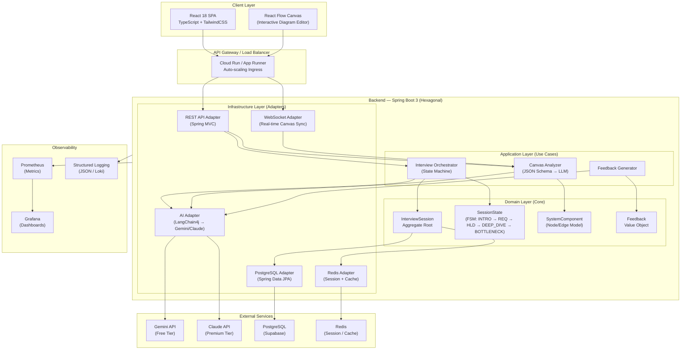
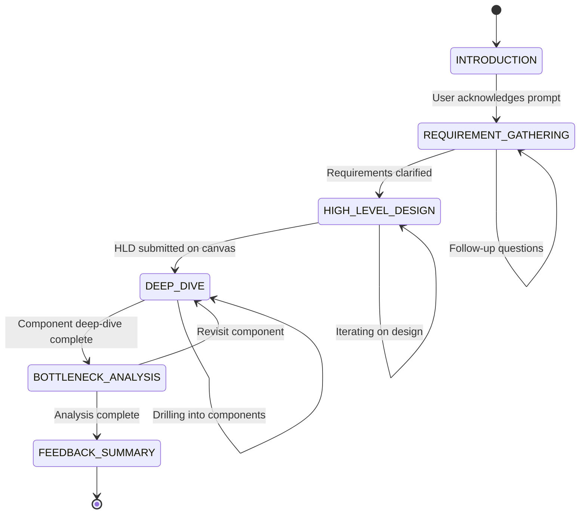
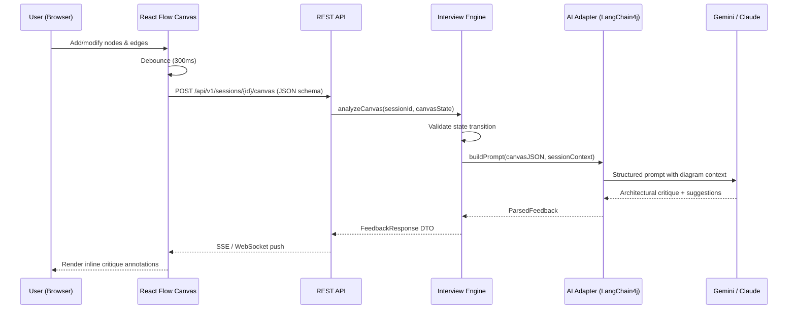
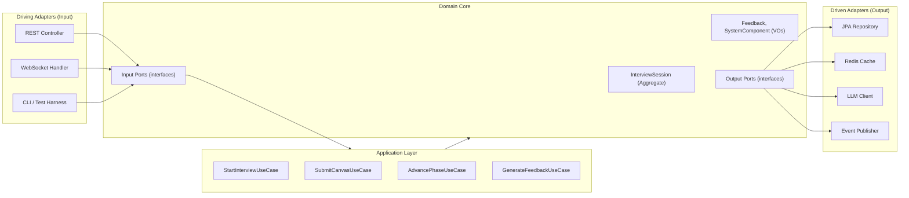

# System-Design-Prep.com — High-Level Architecture

## System Context Diagram

```mermaid
graph TB
    subgraph Client["Client Layer"]
        Browser["React 18 SPA<br/>TypeScript + TailwindCSS"]
        Canvas["React Flow Canvas<br/>(Interactive Diagram Editor)"]
    end

    subgraph API_Gateway["API Gateway / Load Balancer"]
        LB["Cloud Run / App Runner<br/>Auto-scaling Ingress"]
    end

    subgraph Backend["Backend — Spring Boot 3 (Hexagonal)"]
        direction TB
        subgraph Application["Application Layer (Use Cases)"]
            InterviewOrchestrator["Interview Orchestrator<br/>(State Machine)"]
            CanvasAnalyzer["Canvas Analyzer<br/>(JSON Schema → LLM)"]
            FeedbackGenerator["Feedback Generator"]
        end

        subgraph Domain["Domain Layer (Core)"]
            InterviewSession["InterviewSession<br/>Aggregate Root"]
            SessionState["SessionState<br/>(FSM: INTRO → REQ → HLD → DEEP_DIVE → BOTTLENECK)"]
            SystemComponent["SystemComponent<br/>(Node/Edge Model)"]
            Feedback["Feedback<br/>Value Object"]
        end

        subgraph Infrastructure["Infrastructure Layer (Adapters)"]
            REST_API["REST API Adapter<br/>(Spring MVC)"]
            WebSocket["WebSocket Adapter<br/>(Real-time Canvas Sync)"]
            AI_Adapter["AI Adapter<br/>(LangChain4j → Gemini/Claude)"]
            DB_Adapter["PostgreSQL Adapter<br/>(Spring Data JPA)"]
            Cache_Adapter["Redis Adapter<br/>(Session + Cache)"]
        end
    end

    subgraph External["External Services"]
        Gemini["Gemini API<br/>(Free Tier)"]
        Claude["Claude API<br/>(Premium Tier)"]
        Supabase["PostgreSQL<br/>(Supabase)"]
        Redis["Redis<br/>(Session / Cache)"]
    end

    subgraph Observability["Observability"]
        Prometheus["Prometheus<br/>(Metrics)"]
        Grafana["Grafana<br/>(Dashboards)"]
        Logging["Structured Logging<br/>(JSON / Loki)"]
    end

    Browser --> LB
    Canvas --> LB
    LB --> REST_API
    LB --> WebSocket
    REST_API --> InterviewOrchestrator
    REST_API --> CanvasAnalyzer
    WebSocket --> CanvasAnalyzer
    InterviewOrchestrator --> InterviewSession
    InterviewOrchestrator --> SessionState
    CanvasAnalyzer --> SystemComponent
    FeedbackGenerator --> Feedback
    InterviewOrchestrator --> AI_Adapter
    CanvasAnalyzer --> AI_Adapter
    FeedbackGenerator --> AI_Adapter
    AI_Adapter --> Gemini
    AI_Adapter --> Claude
    DB_Adapter --> Supabase
    Cache_Adapter --> Redis
    InterviewSession --> DB_Adapter
    InterviewSession --> Cache_Adapter
    Backend --> Prometheus
    Backend --> Logging
    Prometheus --> Grafana
```

## Interview State Machine

```mermaid
stateDiagram-v2
    [*] --> INTRODUCTION
    INTRODUCTION --> REQUIREMENT_GATHERING : User acknowledges prompt
    REQUIREMENT_GATHERING --> HIGH_LEVEL_DESIGN : Requirements clarified
    HIGH_LEVEL_DESIGN --> DEEP_DIVE : HLD submitted on canvas
    DEEP_DIVE --> BOTTLENECK_ANALYSIS : Component deep-dive complete
    BOTTLENECK_ANALYSIS --> FEEDBACK_SUMMARY : Analysis complete
    FEEDBACK_SUMMARY --> [*]

    REQUIREMENT_GATHERING --> REQUIREMENT_GATHERING : Follow-up questions
    HIGH_LEVEL_DESIGN --> HIGH_LEVEL_DESIGN : Iterating on design
    DEEP_DIVE --> DEEP_DIVE : Drilling into components
    BOTTLENECK_ANALYSIS --> DEEP_DIVE : Revisit component
```

## Sequence Diagram — Canvas Sync + AI Critique

```mermaid
sequenceDiagram
    participant User as User (Browser)
    participant Canvas as React Flow Canvas
    participant API as REST API
    participant Engine as Interview Engine
    participant AI as AI Adapter (LangChain4j)
    participant LLM as Gemini / Claude

    User->>Canvas: Add/modify nodes & edges
    Canvas->>Canvas: Debounce (300ms)
    Canvas->>API: POST /api/v1/sessions/{id}/canvas (JSON schema)
    API->>Engine: analyzeCanvas(sessionId, canvasState)
    Engine->>Engine: Validate state transition
    Engine->>AI: buildPrompt(canvasJSON, sessionContext)
    AI->>LLM: Structured prompt with diagram context
    LLM-->>AI: Architectural critique + suggestions
    AI-->>Engine: ParsedFeedback
    Engine-->>API: FeedbackResponse DTO
    API-->>Canvas: SSE / WebSocket push
    Canvas-->>User: Render inline critique annotations
```

## Hexagonal Architecture Layers

```mermaid
graph LR
    subgraph Driving["Driving Adapters (Input)"]
        REST["REST Controller"]
        WS["WebSocket Handler"]
        CLI["CLI / Test Harness"]
    end

    subgraph App["Application Layer"]
        UC1["StartInterviewUseCase"]
        UC2["SubmitCanvasUseCase"]
        UC3["AdvancePhaseUseCase"]
        UC4["GenerateFeedbackUseCase"]
    end

    subgraph Domain_Core["Domain Core"]
        Agg["InterviewSession (Aggregate)"]
        VO["Feedback, SystemComponent (VOs)"]
        Port_In["Input Ports (interfaces)"]
        Port_Out["Output Ports (interfaces)"]
    end

    subgraph Driven["Driven Adapters (Output)"]
        JPA["JPA Repository"]
        RedisA["Redis Cache"]
        LLM_A["LLM Client"]
        Event["Event Publisher"]
    end

    REST --> Port_In
    WS --> Port_In
    CLI --> Port_In
    Port_In --> App
    App --> Domain_Core
    Domain_Core --> Port_Out
    Port_Out --> JPA
    Port_Out --> RedisA
    Port_Out --> LLM_A
    Port_Out --> Event
```
